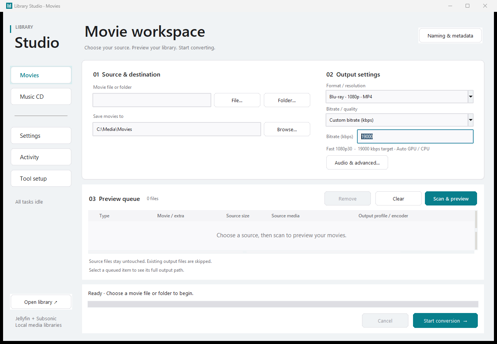

# Library Studio

A desktop workspace for organizing MKV movies and bonus features into a local media library, with optional audio CD ripping on Windows. Built with Python and Tkinter; movie conversion uses HandBrakeCLI.

## Top 3 features

1. **Choose your movie quality:** DVD 480p, 1080p and 4K Blu-ray profiles, custom bitrate/quality, or an exact original MKV copy.
2. **Use your GPU:** automatic NVIDIA, AMD, Intel and Apple encoder selection where supported, with CPU fallback.
3. **Convert a whole library:** movie-year naming, bonus features, surround sound and a batch queue with file/queue time remaining.

The UI includes smooth page transitions, progress updates and navigation feedback. Reduce motion is available in Settings.



## Downloads

- [Windows app ZIP](downloads/LibraryStudio-0.9.0-Windows-x64.zip?raw=true) — extract and run LibraryStudio.exe.
- [Windows executable](LibraryStudio.exe?raw=true) — Python is included.
- [Python source](Transcode_Movie_UI.py) — requires Python 3.10+ and Tcl/Tk.

The Windows download includes runtime notices. HandBrakeCLI is installed through Tool setup on first use.

## Start here

**Windows:** download the Windows release ZIP, extract it, and run `LibraryStudio.exe`. Python is included. Open **Tool setup** to download HandBrakeCLI or choose an existing command-line installation. The HandBrake graphical application alone is not sufficient.

1. Choose an MKV file, movie folder, or parent folder containing movies.
2. Choose your destination, then **Format / resolution**, followed by **Bitrate / quality**. **Automatic (recommended)** selects both from the source.
3. Click **Scan & preview**, review the movie/year, extras, output profile and destination, then start conversion.

The **Source size** column describes the original file, not the predicted output size. Existing output files are skipped. Source movies remain untouched. Conversion uses temporary files and only publishes completed outputs; cancellation removes temporary output.

The format menu groups DVD/480p, HD/720p, 1080p Blu-ray, 4K Blu-ray, and Original MKV. The bitrate menu only offers the choices relevant to that format: Basic, High where available, HandBrake's default quality, a custom bitrate, or custom RF/CQ. Custom values can be entered directly beside these choices. Original MKV retains its source bitrate; Automatic chooses the bitrate from the source. There is no separate DVD shortcut button.

Selecting **Custom bitrate (kbps)** immediately shows a bitrate number field. It stays editable even when the number matches a Basic/High target. **Custom quality (RF / CQ)** shows its own quality number field in the same place.

Sound, encoder selection and saved profiles are in **Settings → Picture & sound** (or **Audio & advanced** in the main view). Save, load and delete your custom profiles there. In compact windows, use the Settings sidebar to reach advanced options.

## Hardware and operating systems

The movie progress panel shows estimated time left for the current file and the whole queue. It starts with **Calculating…**, then updates from measured conversion/copy speed. Queue estimates use pending source file sizes and can change with encoding settings, scene complexity and storage speed. Multi-pass encoding counts all passes; finalizing and transfers are shown separately.

| System | Movies | GPU selection | Audio CD ripping | Tool installation |
| --- | --- | --- | --- | --- |
| Windows 10/11 x64 | Tested here | NVIDIA NVENC, AMD VCN, Intel QSV, CPU | Windows implementation | Verified downloads or choose existing tools |
| macOS | Source/build support; needs native testing | Apple VideoToolbox or CPU, when advertised by HandBrake | Currently unavailable | Install native HandBrakeCLI and choose it |
| Linux desktop | Source/build support; needs native testing | NVIDIA, AMD, Intel or CPU, depending on HandBrake build/drivers | Currently unavailable | Install native HandBrakeCLI and choose it |

**Automatic (GPU preferred)** checks the encoder list provided by the local HandBrakeCLI. It prefers NVIDIA, AMD, Intel, then Apple, and uses CPU when no compatible GPU encoder is available. Selection is per codec: a GPU that supports H.264 may still need CPU for 10-bit HEVC. Hardware availability depends on the HandBrake build, GPU and driver; owning a GPU does not guarantee that its encoder is supported.

If a GPU fails before encoding starts, the app retries that file once with CPU and avoids the failed encoder for the rest of that batch. Cancelling never triggers a retry. Errors after encoding has started are reported rather than restarting a long job. CPU fallback can be disabled in **Settings → Picture & sound**.

**Keep computer responsive** limits software encoder threads to half the logical CPUs, up to eight, and uses below-normal process priority on Windows. GPU encoding still uses CPU for audio, filters and other processing. AMD decoding is performed on the CPU in HandBrake. See the official [NVIDIA](https://handbrake.fr/docs/en/latest/technical/video-nvenc.html), [AMD](https://handbrake.fr/docs/en/latest/technical/video-vcn.html), [Intel](https://handbrake.fr/docs/en/latest/technical/video-qsv.html), and [Apple](https://handbrake.fr/docs/en/latest/technical/video-videotoolbox.html) documentation for current requirements.

## Profiles and output quality

| Profile | Video target | Output |
| --- | --- | --- |
| Automatic | DVD: 2,500; HD: 19,000; above HD: 40,000 kbps | MP4; resolution selected from source |
| DVD 480p | 2,500 kbps | MP4 / H.264, capped at 480p |
| 1080p Basic Blu-ray | 19,000 kbps | MP4 / H.264, capped at 1080p |
| 1080p High Blu-ray | 23,000 kbps | MP4 / H.264, capped at 1080p |
| 4K Basic Blu-ray | 40,000 kbps | MP4 / 10-bit HEVC, capped at 2160p |
| 4K High Blu-ray | 60,000 kbps | MP4 / 10-bit HEVC, capped at 2160p |
| Blu-ray Original Quality | No re-encoding | Exact MKV copy, original video/audio/subtitles |
| HandBrake 720p / 1080p / 4K | HandBrake preset quality | MP4 |

There is no DVD 576p choice. Legacy DVD / 576p settings migrate to 480p when loaded. Smaller sources are not upscaled. The HandBrake preset controls frame rate and other defaults; custom profiles remain editable.

Bitrate is a quality/size target, not a guarantee of a fixed size or no banding. A 110-minute movie at 19,000 kbps video is roughly 15.7 GB before audio and container overhead, but duration, encoder rate control and source complexity affect the actual result. Choose **Original Quality** to preserve the complete source without compression loss. High-bitrate MP4 conversion remains lossy.

Smart Surround provides stereo AAC plus a 5.1 AC3 track when surround audio is detected. You can choose stereo, preset audio, or original-stream passthrough. MP4 cannot carry every codec/subtitle combination; use Original Quality when preserving all streams matters. Bonus features can be numbered, retain their filenames, be placed alongside the main movie, or skipped. The largest MKV is treated as the main feature; review the queue for discs containing multiple cuts.

## Run the source

Requires **Python 3.10+ with Tcl/Tk**. No pip packages are needed to run the app.

```sh
python Transcode_Movie_UI.py
```

On macOS/Linux the command may be `python3`. For Debian/Ubuntu, install `python3-tk` and native `handbrake-cli`; for other systems use their native packages or the [official HandBrakeCLI downloads](https://handbrake.fr/downloads2.php). `HandBrakeCLI` and `ffmpeg` are detected on PATH, in managed tool folders, or at paths selected in Tool setup. Native executable pickers work without an `.exe` extension.

### Settings and portable use

New installations store settings/tools in the user's data folder:

- Windows: `%LOCALAPPDATA%\LibraryStudio`
- macOS: `~/Library/Application Support/LibraryStudio`
- Linux: `$XDG_DATA_HOME/LibraryStudio` or `~/.local/share/LibraryStudio`

Existing installations with a sibling `LibraryStudio-data` folder retain that location. To opt into portable storage, create `portable.flag` beside the app, or use **Tool setup → Create portable folder**. Portable exports include managed tools and profiles but omit saved destination paths and machine settings. Set `LIBRARY_STUDIO_DATA_DIR` to override the data location.

## Music CDs, metadata and privacy

The Windows CD reader saves WAV or MP3, supports editable MusicBrainz metadata and writes metadata sidecars. WAV needs no encoder; MP3 needs FFmpeg. This is a standard audio CD reader, without secure-rip verification. Movie-year lookup and manual overrides are preserved.

Movie-year lookup sends the movie title to IMDb's suggestion endpoint and can be switched off in Naming & metadata. MusicBrainz lookup sends the disc ID. Metadata can be missing or inaccurate and should be reviewed. Media files are processed locally; no media-server account or upload is involved. HandBrake/FFmpeg downloads happen only when requested.

**Settings → Activity → Save activity log** exports conversion commands and diagnostics. Logs contain local file paths; review them before attaching a bug report. Report your OS, app/HandBrake versions, GPU/driver, selected profile, and exact error.

## Build and validate

```sh
python -m pip install -r requirements-build.txt
python -m unittest discover -s tests -v
python Transcode_Movie_UI.py --self-test-report build/ui-report.json
python build.py
```

The UI check requires a graphical desktop; Linux CI uses Xvfb. Tests use temporary settings and generated/mock media and never touch a real movie library.

`build.py` produces a package and SHA-256 checksum under `dist/`. Build separately on each OS/architecture: a Windows `.exe` cannot run on macOS or Linux. This follows [PyInstaller's platform-specific build requirements](https://pyinstaller.org/en/stable/usage.html). The included GitHub Actions workflow tests and builds Windows x64, Linux x64, macOS arm64 and macOS Intel artifacts. It uploads Actions artifacts; publishing a GitHub Release is a separate step. Binaries are currently unsigned.

### Before publishing

Push this source folder, not your personal app-data folders, backups, virtual environment or movie files. Create a GitHub Release and attach the appropriate native build ZIPs. Source code is MIT licensed; external tools retain their own licenses. Configure the MusicBrainz User-Agent contact through `LIBRARY_STUDIO_CONTACT` (your public repository URL or maintainer email) for your published build. Review [THIRD_PARTY.md](THIRD_PARTY.md) when distributing additional tools.

Local verification: 21 unit tests, format/bitrate interaction checks, compact-window/page/theme/animation checks, exact-copy/cancellation and GPU fallback checks. Version 0.8.0 also passed real 1080p and 4K NVIDIA, AMD and CPU conversions on Windows. Intel/Apple selection is covered by simulated capability tests; native Intel, macOS and Linux validation remains to be done.

## License

[MIT](LICENSE) for Library Studio source. HandBrake, FFmpeg, Python/Tcl/Tk and metadata services are covered by their own licenses/terms; see [THIRD_PARTY.md](THIRD_PARTY.md).
